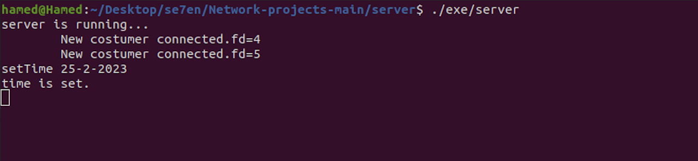
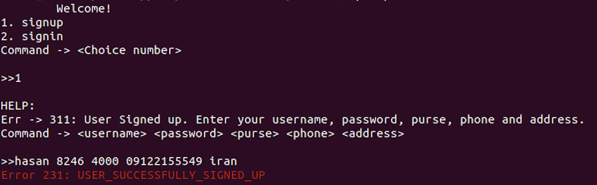
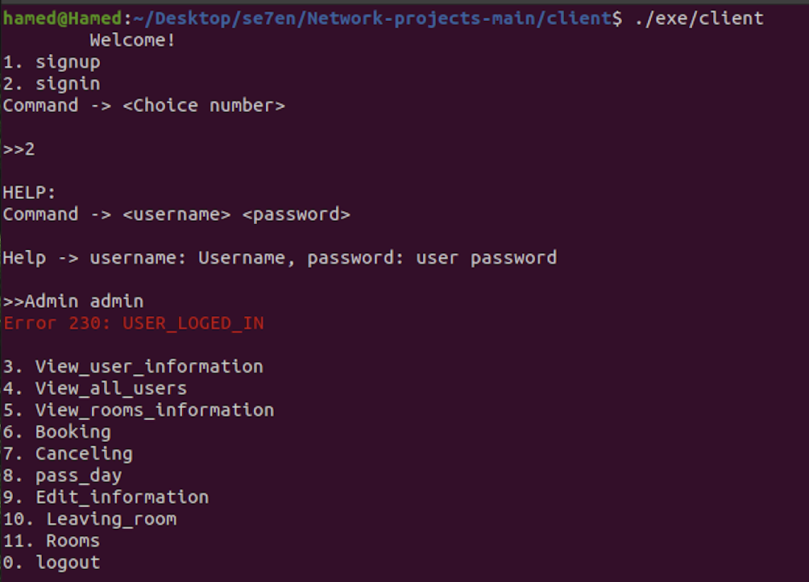
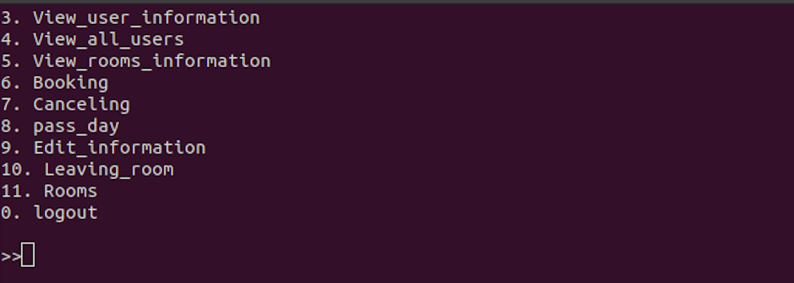

# Computer Networks - CA 1

- [Computer Networks - CA 1](#computer-networks---ca-1)
    - [Introduction](#introduction)
    - [Problem Statement](#problem-statement)
        - [Server](#server)
        - [Client](#client)
            - [1.Admin](#1admin)
            - [2.User](#2user)
    - [How to run](#how-to-run)
        - [Server](#server-1)
        - [Client](#client-1)
    - [Usage](#usage)
        - [Server](#server-2)
        - [Client](#client-2)
    - [Contributors](#contributors)


## Introduction
In this Computer Assignment, we learn about socket programming in C/C++.<br>

## Problem Statement
The problem statement is to create a server and client program that can communicate with each other. The server will be a hotel reservation system and the client will be a person who wants to reserve a room.

### Server
The server is a hotel reservation system that maintains a list of rooms and user information, all of which are stored in JSON files. It is designed to handle multiple client requests simultaneously and provide their responses. The hostname and port number are read from a config.json file and the server will bind to these values accordingly.

Moreover, the server is capable of handling diverse types of requests and responding with relevant data. To ensure the reliability and stability of the system, robust error handling mechanisms will be implemented.

### Client
We have two types of clients, the admin and the user. They have some common functionalities, such as login and logout, change his/her information, but they also have some unique functionalities, such as admin can view all user information and user can reserve a room.

#### 1.Admin
The administrator can log in to the system and view all user information, except for their passwords. They also have the ability to advance the system's date, which can impact room availability and booking status. Furthermore, the administrator is empowered to remove users from rooms as needed, and they can add, remove, or modify room prices as required.

#### 2.User
Users can log in to the system to view their information and all available rooms. They can reserve a room, cancel a reservation, and leave a room before the check-out date.

## How to run
We use makefile to compile the program. There are two makefiles, one for server and one for client. The makefile for server is in the server folder and the makefile for client is in the client folder.


> **Warning**
> It's better to run the server first and then run the client

### Server
Compile the server program by running theses commands in the terminal:
```bash
cd ./server
make
```
then run the server program by running this command:
```bash
./exe/server
```

### Client
Compile the client program by running theses commands in the terminal:
```bash
cd ./client
make
```
then run the client program by running this command:
```bash
./exe/client
```

## Usage
The server and client programs are designed to be used in the terminal, so you should use commands to interact with them.


### Server
The server only has one command to set its date. To do so, you simply need to execute the following command:
```bash
setTime day-month-year
```



### Client

First of all, you need to signin or signup to the system. To do so, you need to execute the following command:
> **Warning**
> After signup, you need to signin to the system.

#### `Signup`
```bash
1
<Username> <password> <purse> <phone> <address>
```



#### `Signin`
```bash
2
<Username> <password>
```



After signing in, the menu panel will become visible:
#### `Menu Panel`



#### `View user information`
This command is applicable to both users and admin:
##### Admin
")

##### User
")


## Contributors
- [Hamed Miramirkhani](https://github.com/HamedMiramirkhani) - 810199500
- [Mostafa Ebrahimi](https://github.com/Ebrahimi-Mostafa) - 810199575